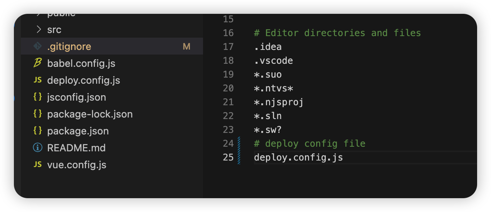
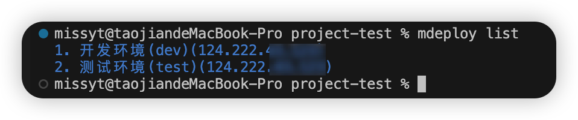

# missyt-deploy
> 一款提升前端开发和验证问题的自动化部署工具，小小流水线的第一步！

## 能做什么
- 自动编译打包
- 自动连接远程服务器
- 自动上传本地包
- 自动备份环境上已有包
- 替换包完毕后，自动执行预设shell命令
- 任意版本回滚

## 亮点优势
> 其实也没什么优势，就是偷会儿懒，咳咳~
- 命令行一键操作，让验证环境问题和本地一样简单
- 前端无需xshell/xftp等工具，无需接触linux服务器
- 操作安全，干啥之前咱先备份！

## 缺点
- 功能较为单一，即使后续扩展，自动化部署仍然为主要核心功能。
- 好的框架支持扩展，目前暂不支持！

## 吹牛展望
- 希望不仅成为自动化部署工具，也可以是团队协同规范的统一工具（依赖扩展）。
- `TODO：已经在考虑中`，支持loader，以插件形式让自动化部署过程中可做的事情更加丰富。但我们的名字是missyt-deploy，所以所有的插件和扩展只会围绕*deploy*来做。
- 实在想法太多，后续会实现在脚手架工具`missyt-cli`中(目前在开发中....)

## 开始使用

### 安装
```shell
npm install missyt-deploy -g

#安装成功后，执行
mdeploy
```


#### 命令行参数
```shell
mdeploy -V #查看当前工具版本
mdeploy -h #查看帮助
mdeploy init #初始化环境
mdeploy list #查看当前项目环境列表
mdeploy run #执行部署，无参数会让其选择执行环境
mdeploy run -e <env>  #<env> 指定环境部署
```

### 开始使用
```shell
cd your project
mdeploy init
```
#### 首次init

##### 做了两件事
- 项目根目录生成配置文件 deploy.config.js

- 将配置文件写入.gitignore中



#### 多次init（不需要）


#### 完善配置项
```js
module.exports = {
  projectName: "mdeploy",
  envList: [
    {
      value: "dev", //环境名称
      name: "开发环境(dev)", //环境描述
      script: "npm run build:dev", //打包脚本,你项目packjson里script中配置的打包脚本
      remotePath: "/opt/xxx/xxx/projectName", //远程服务器部署前端项目的目录
      localPath: "./dist", //本地构建目录
      host: "x.x.x.x", //远程服务器地址
      port: 22, //远程服务器端口
      username: "root", //远程服务器用户名
      password: "*******", //远程服务器密码
      privateKey: "", //远程服务器私钥
      passphrase: "", //远程服务器私钥密码
      shellAfter: ["chown -R user:usre ./projectName"], //部署后执行的脚本
    },
  ],
};
```

### 开始部署
#### 不指定环境
> 不指定环境会读取配置文件中所有环境列表，让其选择。
按enter选择一个环境即可

```shell
mdeploy run # 无参数
```

<span style="color:red">Tips：批量环境部署存在一定风险，所以设计时仅支持单选一个环境部署。</span>
- 选择部署环境


- 开始部署


#### 指定环境

```shell
#指定dev环境 dev => 为配置文件中 envList[index].value的值
mdeoloy run -e dev 
```
- 开始部署


### 查看部署环境列表
```shell
mdeploy list
```


### 版本回滚
```shell
mdeploy back
```
- 选择需要回滚的环境


- 选择需要回滚的包


#### 回滚完成


### 错误异常
> 任何异常都会终端程序往下执行


